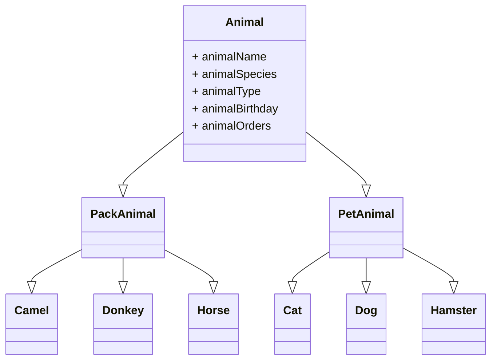

# Итоговая контрольная работа
## Задание 1
Используя команду cat в терминале операционной системы Linux, создать два файла Домашние животные (заполнив файл собаками, кошками, хомяками) и Вьючные животными (заполнив файл Лошадьми, верблюдами и ослы), а затем объединить их. Просмотреть содержимое созданного файла. Переименовать файл, дав ему новое имя (Друзья человека).

    # md Animals
    # cd Animals
    # cat > ./Домашние_животные.txt
    Собака
    Кошка
    Хомяк
    # cat > ./Вьючные_животные.txt
    Лошадь
    Верблюд
    Осел
    # cat Домашние_животные.txt Вьючные_животные.txt > ./Друзья_человека.txt

## Задание 2
Создать директорию, переместить файл туда.

    # md txt_files
    # mv Друзья_человека.txt ./txt_files/
    # rm ./*.txt

## Задание 3
Подключить дополнительный репозиторий MySQL. Установить любой пакет из этого репозитория.
## Задание 4
Установить и удалить deb-пакет с помощью dpkg.
## Задание 5
Выложить историю команд в терминале ubuntu.

    # wget https://dev.mysql.com/get/mysql-apt-config_0.8.28-1_all.deb
    # sudo dpkg -i ./mysql-apt-config_0.8.28-1_all.deb

Запускается текстовый интерфейс для настройки пакета.

    # sudo apt update
    # sudo apt install mysql-client mysql-server

Вводится пароль root для MySQL.

    # mysql_secure_installation
    # rm ./mysql-apt-config_0.8.28-1_all.deb

Производится настройка параметров безопасности MySQL. Убираем ненужный пакетный файл.

    # history >./README.md
    # mcedit ./README.md

Редактируется этот файл в нормальном консольном редакторе. При желании, можно воспользоваться комадой

    # vim ./README.md

## Задание 6
Нарисовать диаграмму, в которой есть класс родительский класс, домашние
животные и вьючные животные, в составы которых в случае домашних
животных войдут классы: собаки, кошки, хомяки, а в класс вьючные животные
войдут: Лошади, верблюды и ослы.

## Задание 7
В подключенном MySQL репозитории создать базу данных "Друзья человека".

    # mysql -u root -p

    CREATE DATABASE human_friends DEFAULT CHARACTER SET utf8 DEFAULT COLLATE utf8_general_ci;
    USE human_friends;

## Задание 8
Создать таблицы с иерархией из диаграммы в БД

    CREATE TABLE t_animal_type (
        type_id int PRIMARY KEY NOT NULL AUTO_INCREMENT COMMENT 'Идентификатор типа',
        type_anno varchar(255) NOT NULL COMMENT 'Названия типа'
    );
    ALTER TABLE t_animal_type COMMENT = 'Таблица типов животных';

    CREATE TABLE t_animal_species (
        species_id int PRIMARY KEY NOT NULL AUTO_INCREMENT COMMENT 'Идентификатор вида',
        species_anno varchar(255) NOT NULL COMMENT 'Название вида',
        type_id int NOT NULL COMMENT 'Идентификатор типа'
    );
    ALTER TABLE t_animal_species COMMENT = 'Таблица видов животных';

    CREATE TABLE t_animals (
        animal_id int PRIMARY KEY NOT NULL AUTO_INCREMENT COMMENT 'Идентификатор животного',
        animal_name varchar(255) COMMENT 'Кличка животного',
        animal_birthdate date NOT NULL COMMENT 'Дата рождения животного',
        species_id int NOT NULL COMMENT 'Вид животного'
    );
    ALTER TABLE t_animals COMMENT = 'Таблица животных';

    CREATE TABLE t_orders (
        order_id int PRIMARY KEY NOT NULL AUTO_INCREMENT COMMENT 'Идентификатор приказа',
        order_anno varchar(255) NOT NULL COMMENT 'Описание приказа'
    );
    ALTER TABLE t_orders COMMENT = 'Таблица приказов';

    CREATE TABLE l_animal_orders (
        link_id int PRIMARY KEY NOT NULL AUTO_INCREMENT COMMENT 'Идентификатор связи',
        order_id int NOT NULL COMMENT 'Идентификатор приказа',
        animal_id int NOT NULL COMMENT 'Идентификатор животного'
    );

    CREATE INDEX t_animal_species_idx ON t_animal_species (type_id);
    CREATE INDEX t_animals_idx ON t_animals (species_id);

    ALTER TABLE t_animals ADD FOREIGN KEY (species_id) REFERENCES t_animal_species (species_id) ON DELETE CASCADE;
    ALTER TABLE t_animal_species ADD FOREIGN KEY (type_id) REFERENCES t_animal_type (type_id) ON DELETE CASCADE;
    ALTER TABLE l_animal_orders ADD FOREIGN KEY (order_id) REFERENCES t_orders (order_id)  ON DELETE CASCADE;
    ALTER TABLE l_animal_orders ADD FOREIGN KEY (animal_id) REFERENCES t_animals (animal_id)  ON DELETE CASCADE;
    SHOW TABLES;

    +-------------------------+
    | Tables_in_human_friends |
    +-------------------------+
    | l_animal_orders         |
    | t_animal_species        |
    | t_animal_type           |
    | t_animals               |
    | t_orders                |
    +-------------------------+

## Задание 9
Заполнить низкоуровневые таблицы именами(животных), командами которые они выполняют и датами рождения

    INSERT INTO t_animal_type (type_anno) VALUES ('Домашние'), ('Вьючные');
    SELECT * FROM t_animal_type;

    +---------+------------------+
    | type_id | type_anno        |
    +---------+------------------+
    |       1 | Домашние         |
    |       2 | Вьючные          |
    +---------+------------------+

    INSERT INTO t_animal_species (species_anno, type_id) VALUES
        ('Коты', 1),
        ('Собаки', 1),
        ('Хомячки', 1),
        ('Лошади', 2),
        ('Верблюды', 2),
        ('Ослы', 2);
    SELECT * FROM t_animal_species;

    +------------+------------------+---------+
    | species_id | species_anno     | type_id |
    +------------+------------------+---------+
    |          1 | Коты             |       1 |
    |          2 | Собаки           |       1 |
    |          3 | Хомячки          |       1 |
    |          4 | Лошади           |       2 |
    |          5 | Верблюды         |       2 |
    |          6 | Ослы             |       2 |
    +------------+------------------+---------+

    INSERT INTO t_animals (animal_name, animal_birthdate, species_id) VALUES
        ('Кот Январь', '2022-01-01', 1),
        ('Кошка Февраль', '2019-02-01', 1),
        ('Собака Март', '2022-03-01', 2),
        ('Собака Апрель', '2019-04-01', 2),
        ('Хомяк', '2023-05-01', 3),
        ('Хомяк', '2019-06-01', 3),
        ('Фаворит', '2022-07-01', 4),
        ('Вихрь', '2019-08-01', 4),
        ('Большой', '2022-09-01', 5),
        ('Маленький', '2019-10-01', 5),
        ('Осел 1', '2022-11-01', 6),
        ('Осел 2', '2019-12-01', 6);
    SELECT * FROM t_animals;
    +-----------+---------------------------+------------------+------------+
    | animal_id | animal_name               | animal_birthdate | species_id |
    +-----------+---------------------------+------------------+------------+
    |         1 | Кот Январь                | 2022-01-01       |          1 |
    |         2 | Кошка Февраль             | 2019-02-01       |          1 |
    |         3 | Собака Март               | 2022-03-01       |          2 |
    |         4 | Собака Апрель             | 2019-04-01       |          2 |
    |         5 | Хомяк                     | 2023-05-01       |          3 |
    |         6 | Хомяк                     | 2019-06-01       |          3 |
    |         7 | Фаворит                   | 2022-07-01       |          4 |
    |         8 | Вихрь                     | 2019-08-01       |          4 |
    |         9 | Большой                   | 2022-09-01       |          5 |
    |        10 | Маленький                 | 2019-10-01       |          5 |
    |        11 | Осел 1                    | 2022-11-01       |          6 |
    |        12 | Осел 2                    | 2019-12-01       |          6 |
    +-----------+---------------------------+------------------+------------+

    INSERT INTO t_orders (order_anno) VALUES
        ('Ко мне!'),
        ('Лежать!'),
        ('Сидеть!'),
        ('Барьер!'),
        ('Вперед!'),
        ('Вставать!');
    SELECT * FROM t_orders;
    +----------+-------------------+
    | order_id | order_anno        |
    +----------+-------------------+
    |        1 | Ко мне!           |
    |        2 | Лежать!           |
    |        3 | Сидеть!           |
    |        4 | Барьер!           |
    |        5 | Вперед!           |
    |        6 | Вставать!         |
    +----------+-------------------+

    INSERT INTO l_animal_orders (order_id, animal_id) VALUES
        (1, 3), (1, 4), (1, 7), (1, 8), (1, 9), (1, 10), (1, 11), (1, 12),
        (2, 3), (2, 4), (2, 7), (2, 8), (2, 9), (2, 10),
        (3, 3), (3, 4),
        (4, 3), (4, 4), (4, 7), (4, 8),
        (5, 3), (5, 4), (5, 7), (5, 8), (5, 9), (5, 10), (5, 11), (5, 12),
        (6, 7), (6, 8), (6, 9), (6, 10);
    SELECT ta.animal_name, tor.order_anno FROM t_animals ta
	    INNER JOIN l_animal_orders lao ON ta.animal_id = lao.animal_id 
	    INNER JOIN t_orders tor ON lao.order_id = tor.order_id
	    ORDER BY ta.animal_id;
    +---------------------------+-------------------+
    | animal_name               | order_anno        |
    +---------------------------+-------------------+
    | Собака Март               | Ко мне!           |
    | Собака Март               | Вперед!           |
    | Собака Март               | Барьер!           |
    | Собака Март               | Сидеть!           |
    | Собака Март               | Лежать!           |
    | Собака Апрель             | Ко мне!           |
    | Собака Апрель             | Вперед!           |
    | Собака Апрель             | Барьер!           |
    | Собака Апрель             | Сидеть!           |
    | Собака Апрель             | Лежать!           |
    | Фаворит                   | Лежать!           |
    | Фаворит                   | Вставать!         |
    | Фаворит                   | Вперед!           |
    | Фаворит                   | Ко мне!           |
    | Фаворит                   | Барьер!           |
    | Вихрь                     | Ко мне!           |
    | Вихрь                     | Вставать!         |
    | Вихрь                     | Вперед!           |
    | Вихрь                     | Барьер!           |
    | Вихрь                     | Лежать!           |
    | Большой                   | Ко мне!           |
    | Большой                   | Вперед!           |
    | Большой                   | Лежать!           |
    | Большой                   | Вставать!         |
    | Маленький                 | Ко мне!           |
    | Маленький                 | Лежать!           |
    | Маленький                 | Вперед!           |
    | Маленький                 | Вставать!         |
    | Осел 1                    | Ко мне!           |
    | Осел 1                    | Вперед!           |
    | Осел 2                    | Ко мне!           |
    | Осел 2                    | Вперед!           |
    +---------------------------+-------------------+

## Задание 10
Удалив из таблицы верблюдов, т.к. верблюдов решили перевезти в другой питомник на зимовку. Объединить таблицы лошади, и ослы в одну таблицу.

    DELETE FROM t_animal_species WHERE species_id = 5;
    INSERT INTO t_animal_species (species_anno, type_id) VALUES
        ('Лошади и ослы', 2);
    SELECT * FROM t_animal_species;
    +------------+--------------------------+---------+
    | species_id | species_anno             | type_id |
    +------------+--------------------------+---------+
    |          1 | Коты                     |       1 |
    |          2 | Собаки                   |       1 |
    |          3 | Хомячки                  |       1 |
    |          4 | Лошади                   |       2 |
    |          6 | Ослы                     |       2 |
    |          7 | Лошади и ослы            |       2 |
    +------------+--------------------------+---------+

    UPDATE t_animals SET species_id = 7 WHERE species_id = 4 OR species_id = 6;
    DELETE FROM t_animal_species WHERE species_id = 4 OR species_id = 6;
    SELECT ta.animal_name, tas.species_anno FROM t_animals ta
	    INNER JOIN t_animal_species tas ON ta.species_id = tas.species_id;
    +---------------------------+--------------------------+
    | animal_name               | species_anno             |
    +---------------------------+--------------------------+
    | Кот Январь                | Коты                     |
    | Кошка Февраль             | Коты                     |
    | Собака Март               | Собаки                   |
    | Собака Апрель             | Собаки                   |
    | Хомяк                     | Хомячки                  |
    | Хомяк                     | Хомячки                  |
    | Фаворит                   | Лошади и ослы            |
    | Вихрь                     | Лошади и ослы            |
    | Осел 1                    | Лошади и ослы            |
    | Осел 2                    | Лошади и ослы            |
    +---------------------------+--------------------------+
## Задание 11
Создать новую таблицу "молодые животные" в которую попадут все животные старше 1 года, но младше 3 лет и в отдельном столбце с точностью до месяца подсчитать возраст животных в новой таблице.

    ALTER TABLE t_animals ADD animal_is_yong bool
        NULL COMMENT 'Признак молодого животного';
    ALTER TABLE t_animals ADD animal_age int
        NULL COMMENT 'Возраст животного';
    UPDATE t_animals SET animal_age = TIMESTAMPDIFF(YEAR, animal_birthdate, CURDATE());
    UPDATE t_animals SET animal_is_yong = CASE
        WHEN animal_age < 3 AND animal_age >=1 THEN True
        ELSE False
    END;
    CREATE TABLE t_young_animals AS
        SELECT * FROM t_animals WHERE animal_is_yong;
    SELECT animal_name FROM t_young_animals;
    +-----------------------+
    | animal_name           |
    +-----------------------+
    | Кот Январь            |
    | Собака Март           |
    | Фаворит               |
    | Осел 1                |
    +-----------------------+

## Задание 12
Объединить все таблицы в одну, при этом сохраняя поля, указывающие на прошлую принадлежность к старым таблицам.

    CREATE TABLE t_animals_all AS SELECT
        ta.animal_id  t_animals_animal_id,
        tat.type_anno as t_animal_type_anno,
        tas.species_anno as t_animal_species_anno,
        ta.animal_name as t_animals_animal_name,
        ta.animal_birthdate as t_animals_animal_birthday,
        tog.animal_orders as t_orders_animal_orders
    FROM t_animals ta
    LEFT JOIN t_animal_species tas ON ta.species_id = tas.species_id 
    LEFT JOIN t_animal_type tat ON tas.type_id = tat.type_id 
    LEFT JOIN (
        SELECT
            ta.animal_id,
            GROUP_CONCAT(DISTINCT tor.order_anno SEPARATOR ' ') animal_orders
        FROM t_animals ta
        INNER JOIN l_animal_orders lao ON ta.animal_id = lao.animal_id 
        INNER JOIN t_orders tor ON lao.order_id = tor.order_id
        GROUP BY ta.animal_id) AS tog
    ON ta.animal_id = tog.animal_id;
    DESCRIBE t_animals_all;
    +---------------------------+--------------+------+-----+---------+-------+
    | Field                     | Type         | Null | Key | Default | Extra |
    +---------------------------+--------------+------+-----+---------+-------+
    | t_animals_animal_id       | int          | NO   |     | 0       |       |
    | t_animal_type_anno        | varchar(255) | YES  |     | NULL    |       |
    | t_animal_species_anno     | varchar(255) | YES  |     | NULL    |       |
    | t_animals_animal_name     | varchar(255) | YES  |     | NULL    |       |
    | t_animals_animal_birthday | date         | NO   |     | NULL    |       |
    | t_orders_animal_orders    | text         | YES  |     | NULL    |       |
    +---------------------------+--------------+------+-----+---------+-------+

## Задание 13.
Создать класс с Инкапсуляцией методов и наследованием по диаграмме.

    см. AnimalsApp

## Задание 14.
Написать программу, имитирующую работу реестра домашних животных.

    см. AnimalsApp